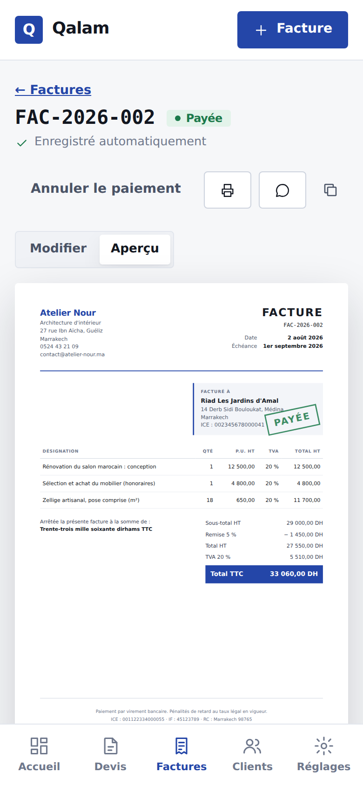

# Qalam — Application de devis et factures

Application web pour créer des devis et des factures conformes aux usages marocains, pensée pour les artisans et les freelances.
HTML, CSS et JavaScript **sans framework ni librairie**, installable sur téléphone et **utilisable hors connexion**.

**Démo en ligne :** _(lien Netlify à ajouter après la mise en ligne)_

> **Projet de démonstration** pour mon portfolio : l'entreprise « Atelier Nour », ses clients et ses documents sont fictifs. Cette application n'a pas été réalisée pour un client.

## Fonctionnalités

- **Tableau de bord** : encaissé du mois, montants à encaisser, factures en retard, devis en attente, liste « À faire » classée par urgence.
- **Devis et factures** : éditeur avec **aperçu A4 en direct**, lignes de prestations, remise globale, **TVA marocaine** (20, 14, 10, 7 et 0 %) calculée taux par taux.
- **Montant en toutes lettres** (« Arrêtée la présente facture à la somme de… »), selon les règles de l'orthographe française.
- **Numérotation continue** par année (DEV-2026-001, FAC-2026-001). Une facture reçoit son numéro seulement quand elle est émise, puis elle est **figée** et ne peut plus être supprimée, comme l'exige la loi.
- **Devis → facture** en un clic, **statuts** (brouillon, envoyé, accepté, refusé, émise, payée) et passage **automatique en retard** après l'échéance.
- **Clients** avec vérification de l'ICE (15 chiffres), du téléphone marocain et de l'e-mail.
- **PDF** (impression) et **envoi par WhatsApp** avec un message déjà rédigé.
- **Sauvegarde automatique**, export et import d'une sauvegarde (fichier JSON), synchronisation entre onglets.

## Ce qui montre le niveau technique

| Point | Détail |
|---|---|
| **Tests automatiques** | 13 tests des calculs (`node --test`), relancés par GitHub à chaque envoi de code (badge ci-dessus) |
| **Montants en centimes** | Tous les montants sont des nombres entiers : aucune erreur d'arrondi (en JavaScript, 0,1 + 0,2 ≠ 0,3) |
| **Application installable (PWA)** | Manifeste + service worker : l'application s'installe sur l'écran d'accueil et s'ouvre sans internet |
| **Mode clair / sombre** | Automatique selon le système, ou choisi dans les réglages (mémorisé) |
| **Composants sur mesure** | Liste déroulante et calendrier dessinés à la main, accessibles au clavier (rôles ARIA) : aucun contrôle au style du navigateur |
| **Raccourcis clavier** | `N` nouveau document, `/` rechercher, `G` puis `F` factures, `?` aide |
| **Container queries** | Les lignes de prestations s'adaptent à la largeur de leur panneau, pas seulement à celle de l'écran |
| **Architecture** | Calculs « purs » séparés de l'affichage, store unique avec abonnements, routeur par l'adresse (#/factures), données toujours nettoyées à la lecture |
| **Sécurité** | Tout texte affiché est échappé (protection XSS) ; un fichier importé invalide est refusé |

## Structure

| Fichier | Rôle |
|---|---|
| `index.html` | La page unique de l'application |
| `css/app.css` | Le design : thème clair/sombre, composants, document A4, impression |
| `js/calculs.js` | Calculs purs : totaux, TVA, montant en lettres, numérotation, dates, validations |
| `js/donnees.js` | Les données : chargement, nettoyage, enregistrement, actions (émettre, payer, transformer…) |
| `js/composants.js` | Liste déroulante, calendrier, notifications, confirmation en deux clics |
| `js/vues.js` | Les écrans : tableau de bord, listes, éditeur, clients, réglages |
| `js/app.js` | Démarrage, navigation, raccourcis clavier, mode hors connexion |
| `sw.js` · `manifest.webmanifest` | Application installable et hors connexion |
| `tests/calculs.test.js` | Tests automatiques |

## Lancer en local

- Ouvrir `index.html` dans un navigateur suffit.
- Pour le mode hors connexion, il faut un petit serveur local : `python3 -m http.server` dans ce dossier, puis ouvrir `http://localhost:8000`.
- Tests : `node --test site-2-factures/tests/*.test.js` depuis la racine du dépôt (Node 18 ou plus récent, rien à installer).

## Ce que j'explique en entretien

1. **Pourquoi des centimes ?** Parce que les nombres à virgule sont approximatifs en informatique. Sur une facture, une erreur d'un centime n'est pas acceptable.
2. **Pourquoi séparer les calculs ?** Une fonction qui ne dépend pas de la page se teste automatiquement. C'est ce qui permet le badge vert.
3. **Pourquoi le statut « en retard » n'est pas enregistré ?** Il est calculé à partir de la date. Une facture passe donc en retard toute seule, sans rien mettre à jour.
4. **Pourquoi une facture émise est figée ?** Au Maroc comme en France, une facture émise ne se modifie pas et la numérotation doit être continue. On corrige avec un avoir.
5. **Bugs trouvés grâce aux tests** : une boucle infinie à la création d'un document (la sauvegarde relançait la création), et l'onglet « Aperçu » sur mobile qui ne cachait pas le formulaire.

## Limites (projet de démonstration)

Les données restent dans le navigateur de l'utilisateur (pas de serveur ni de compte). Une version réelle ajouterait un serveur, des comptes et l'envoi des factures par e-mail.
